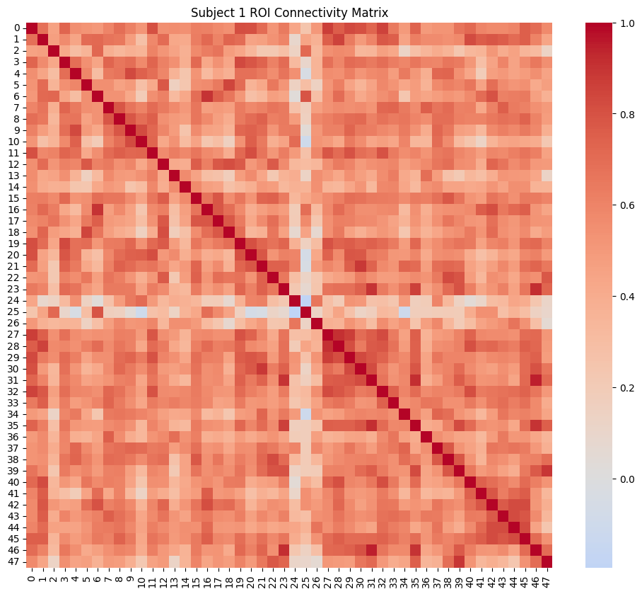

# Predicting Age from Multi-Subject Resting-State ROI Functional Connectivity

## Overview

This project builds a machine learning pipeline to predict participant age from resting-state fMRI functional connectivity patterns.
Using atlas-based ROI signals extracted from fMRI scans, connectivity matrices were generated and used as features in a predictive model.

---

## Dataset

* Nilearn Developmental fMRI Dataset
* 30 subjects
* Resting-state scans
* Age metadata available

---

## Methods

* Data download with Nilearn
* ROI extraction using Harvard-Oxford atlas
* Functional connectivity matrices
* Feature engineering
* Ridge Regression
* 5-fold cross-validation

---

## Repository Files

* `01_data_download.ipynb`
* `02_roi_extraction.ipynb`
* `03_age_prediction.ipynb`

---

## Skills Demonstrated

* Python
* Neuroimaging analysis
* Functional connectivity
* Machine learning
* Scientific workflows

---

## Example Output

### ROI Functional Connectivity Matrix

---

## Results

The pipeline successfully:

* Downloaded and processed multi-subject resting-state fMRI data
* Extracted ROI time series from atlas-defined cortical regions
* Generated subject-level functional connectivity matrices
* Built a predictive modelling framework for age estimation
* Demonstrated an end-to-end reproducible neuroimaging workflow

Model performance metrics can be updated as additional experiments are completed.
